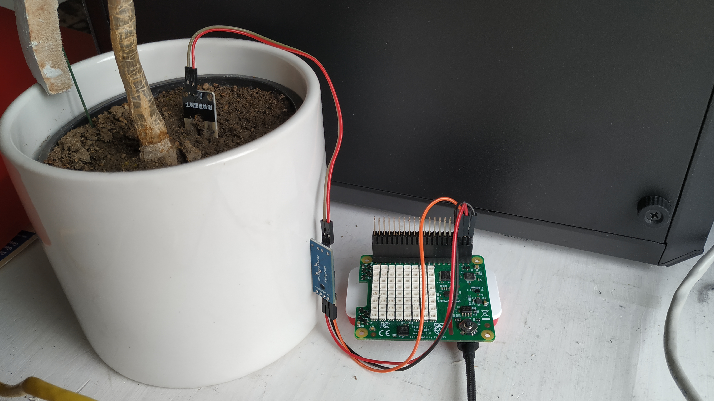
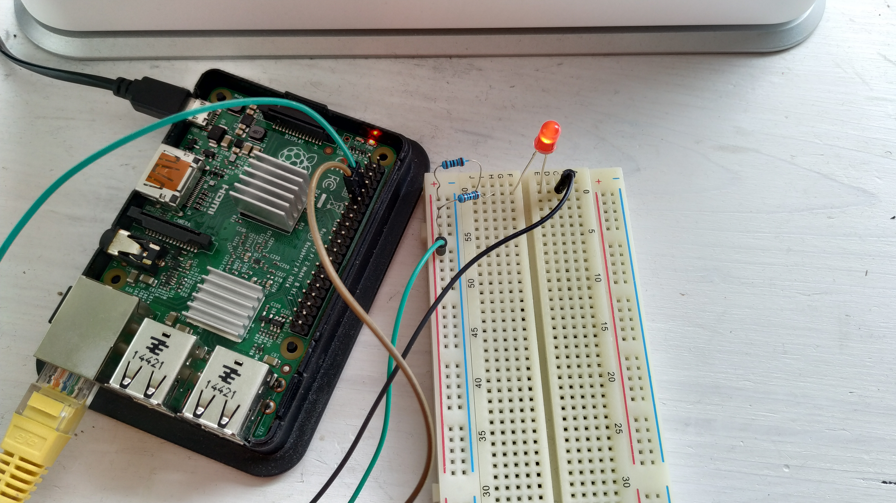

# The Raspberry Pi plant soil moisture detector #

A demonstration on how to use two different small-scale systems, sensors and actuators as a whole system for detecting the water levels of a plant. This project was designed and written program as the main part of the exercise track for the course Embedded and Pervasive Systems by Alois Ferscha, a part of the bachelor’s course for Computer Science at Johannes Kepler University (JKU), Linz.

<!-- TOC -->

- [Raspi-Water-Detector](#raspi-water-detector)
  - [General info](#general-info)
  - [Technologies](#technologies)
    - [Used hardware](#used-hardware)
    - [Used software](#used-software)
  - [Setup](#setup)
    - [Setting up the hardware](#setting-up-the-hardware)
    - [Setting up the software](#setting-up-the-software)
      - [Detection unit](#detection-unit)
      - [Server unit](#server-unit)
  - [Functionality](#functionality)
  - [Demonstration](#demonstration)
  - [Credits](#credits)
  - [License](#license)

<!-- /TOC -->

## General info ##

With climate change being a global news topic like never before, it is clear we have to think about changes in dealing with rising heat in agriculture and planting. While farmers will have to deal with huge upheaval, also flower-enthusiasts and small gardeners must face new challenges in watering their
beloved plants in the right time and with the right quantity of liquid. In order to help the vegetation with staying hydrated and to release burden from the owner, we aim to implement a project that automates certain activities and makes the home or office a little bit smarter. This is a perfect example
for a future component of a smart city. The planned system aims to monitor humidity in a flowerpot and provide the owner with feedback on the healthiness of his plant from a watering perspective. We also want to utilize a temperature sensor to measure environmental influences and hint at the plant
owner that additional watering may be needed. The gathered data is to be visualized in form of charts, so the relevant metrics may be monitored conveniently over some time. With the described approach, we advocate for reducing the amount of dying plants in the summer by a good amount and keeping our planet a little bit greener.

## Technologies ##

This project consist of a hardware and a software part. For this course, two Raspberry Pis were used as they were provided by the institute, but it should be mentioned that especially for the detection unit a microcontroller, which runs on much less power, can and eventually should be used for longer runtimes on a battery unit.

The software part is written for the usage of the selected hardware, therefore swapping of units can result into the need to rewrite some code parts.

### Used hardware ###

- Two Raspberry Pis
- Raspberry Pi Sense HAT (temperature reading)
- Resistive moisture sensor (can be replaced by a capacitive sensor), model “Iduino ME110”
- Analogue-Digital-Converter (ADC), model “Microchip Technology MCP3008”
- LED
- Resistor
- Breakout-Board

### Used software ###

- Python
- MQTT
- SQL

## Setup ##

This guide assumes a fresh installation of the OS and installs the needed packages. It will also install a new database in the server unit. If some of these actions are not suited for your current setup, DO NOT run the `install.sh` files to avoid problems with the current setup.

For the physical setup, some pins will be used. These need to be later specified in the script files when mentioned.

### Setting up the hardware ###

Both Raspberry Pis need access to the internet or at least an Ethernet / WiFi connection. Whichever Pi is chosen as the detection unit also needs the PiHat and the moisture sensor via de ADC connected to it using GPIO digital pins. The used pins need to be specified later in the software. Please not that not all pins are useable as they could be +5V, +3.3V, GND or used for communication. Our example is using the following pins

- ADC Ground to any ground (example PIN 39)
- VDD (+5V) to Pin 37 (GPIO26)
- Data-Line (Example DO) to Pin 35 (GPIO19)



The other Pi gets the LED connected via an suiteable resistor which depends on the used voltage (3.3V or 5V) and the used LED.



A list of all pins of an Raspberry Pi can be viewed here: <https://pinout.xyz/>

### Setting up the software ###

On both the detection and the server unit, some software needs to be installed and some configurations be undertaken. The used operating system is Raspberry OS lite, but any other distribution using a Debian base should be suitable for the provided installer scripts. A list of the official system images can be found here: <https://www.raspberrypi.org/software/operating-systems/>

#### Detection unit ####

A script for installing the needed packages and updating the system is provided under `DetectionUnit/install.sh`. Note that the file should be run as root.

After this, place the `getSensorData.py` where it is suited (example in the home directory) and setup a periodically enabled cronjob. Type `sudo crontab -e` into the bash and paste the following at the end of the file. Note that the full path needs to python has to be declared, otherwise the execution fails.

```test
*/10 * * * * /usr/bin/python <path/to/getSensorData.py>
```

In order to function with your setup, some lines in `getSensorData.py` have to be modified.

```PYTHON
MQTT_SERVER = "the.server.to.send.to"
enableReading = LED("GPIOxy")
readingPin = Button("GPIOab")
```

The MQTT-server specifies where the data ist sent to, this can be a local IPv4 address or any symbolic address as long as it can be resolved by the DNS server. For reading pin and the enable pin, the GPIO port used has to be specified using, an example could be `GPIO26`.

To test if the the packages were installed correctly and are useable, run the `getSensorData.py` file once using `python getSensorData.py`. This sends the read data to the server unit.

For this part, the commands inside the `install.sh` are:

```BASH
apt update
apt upgrade
apt install sense-hat python-gpiozero python-pip
pip install paho-mqtt
```

#### Server unit ####

Before running the installer script, some files need to be modified. These include `createDatabase.sql` and `dataHandler.py`. The databse is used to store previously meassured results and the data can be used to write a simple web application which displays the values in a proper fashion.

For `createDatabase.sql`, please specify the parameters user, server (most often the localhost) and password:

```SQL
CREATE USER IF NOT EXISTS 'user'@'server' IDENTIFIED BY 'Password';
GRANT ALL PRIVILEGES ON plantdb.* TO 'user'@'server';
FLUSH PRIVILEGES;
```

Optionally, another database name can obviously be chosen if the current suggestion is not suited.

For `dataHandler.py`, specify the GPIO-Pin used for the LED as well as the database connection, username and password. If you modified the database name, please also change here.

```PYTHON
ledPin = LED("GPIOxy")

connection = mysql.connector.connect(host='localhost',
                        database='plantdb',
                        user='user',
                        password='password')
```

Again, the provided install script under `DetectionUnit/install.sh` will update the package list and system, install the needed packages, run the secure installation of mysql and install the database. If any of these actions are *not* wanted, do *not* use the provided installer, but execute the commands you need yourself. Note that the installer will use the modified `createDatabase.sql` to create the database and the user. If you run the mysqlsecureinstallation, the default options are usually a good choice.

After this, place the `dataHandler.py` where it is suited (example in the home directory) and setup an periodically enabled cronjob. Type `sudo crontab -e` into the bash and paste the following at the end of the file. Note that the full path needs to python has to be declared, otherweise the execution fails. The command python file will be started with the system and runs forever in the background.

```test
 @reboot /usr/bin/python <Absolute/Path/To/dataHandler.py>
```

For this part, the commands inside the `install.sh` are:

```BASH
apt update
apt upgrade
apt install mosquitto python-gpiozero python-pip
pip install paho-mqtt mysql-connector-python
apt install mariadb-server -y
mysql_secure_installation
mysql -u root -p < createDatabase.sql
```

## Functionality ##

The detection unit executes the reading script every ten minutes. It will connect to the MQTT server, activate the sensors, read values and switch off the WiFi and sensor again to save power.

The server unit runs the according script in the background and whenever the published values of water and temperature are both available, it will read both values and store them into the database. Whenever the moisture level drops below a certain value, the LED will activate and gives the plant owner an optical signal that water is needed.

As the read data is stored in a database, further extension can easily be done.

## Demonstration ##

For demonstration purposes, a small video was recorded which demonstrates the setup of the hardware and the small web interface. It can be found on YouTube under <https://www.youtube.com/watch?v=Dot-cLDjO4Y&feature=youtu.be>. Please note that the graphs shown are not part of the provided sourcecode due to licencing issues. The according functionality can obviously be implemented again on a personal basis.

## Credits ##

This work has been realized thanks to the amazing help of Christoph Penner (<https://github.com/christophpe>) and Markus Arbeithuber (<https://github.com/MarkusArb>), with whom I took the already mentioned course and were great team players.

## License ##

This code is published under the GNU GENERAL PUBLIC LICENSE Version 3, 29 June 2007. This allows for private and commercial use, modification and distribution of the software as well as for patent use. In general, this software has neither warranty nor liability from my, the creators, side. If you use this source code, you also need to publish the code under the same licence. The copyright and the license notice must be preserved, and the source must be disclosed (published) when changes are made. Please note that some files were made available by other authors and their respective copyright applies.
